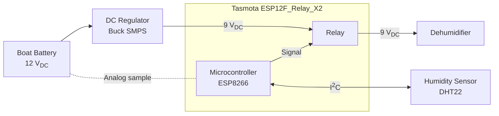

# Humidity Switch

Design for a humidity-controlled switch, originally intended to be used to run a dehumidifier on a sailboat.

The design is:
- Low power, designed to be battery operated
- Simple, using off-the shelf parts where possible
- Cheap

## System Diagram

## References

- [MicroPython Reference](https://docs.micropython.org/en/latest/esp8266/quickref.html)
- [ESP8266 GPIO](https://randomnerdtutorials.com/esp8266-pinout-reference-gpios/)
- Tasmota ESP12F Relay X2 - [Official Page](https://templates.blakadder.com/ESP12F_Relay_X2.html)
- Tasmota ESP12F Relay X2 - [PDF](docs/ESP12F_Relay_X2.pdf)